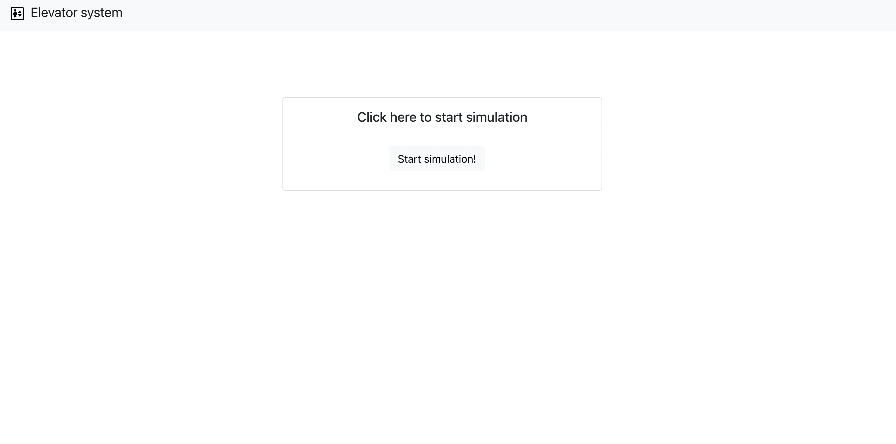
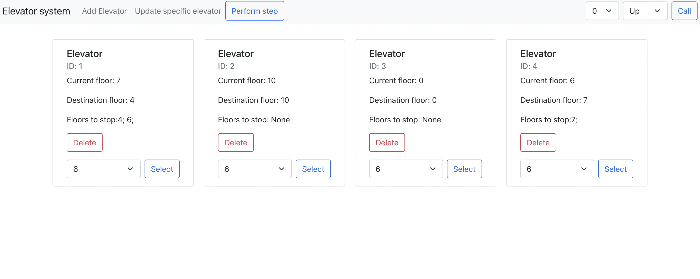
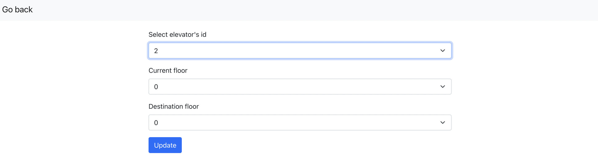

# Elevator control system

## Table of Contents
  - [Description](#description)
  - [Technologies](#technologies)
  - [How to run](#how-to-run)
  - [How it works](#how-it-works)
  - [Algorithm](#algorithm)

## Description
Elevator control system is full-stack app, which simulates elevators working process. Every elevator is saved in database.

User can:
* add new elevator
* call an elevator on specific floor
* update specific elevator 
* make an elevator go on a chosen floor (as he would be in elevator)
* perform steps in simulation 
* delete elevators

## Technologies
* Java 17
* Spring
* React

## How to run 
Clone the repository from github.
```
$ git clone https://github.com/ajablonsk1/elevator-control-system.git
```
* Open 'api' folder in IDE and simply run ElevatorSystemApplication class.
* Open 'frontend' folder in IDE and type `npm start` in terminal. You might need to download some dependencies.

## How it works
First site should look like this: 


After clicking start simulation you will see this:

* Add elevator - navigates us to site where we can add new elevator by filling the form

* Update specific elevator - navigates us to site where we can add update specific elevator

* Perform step - perform one step in simulation
* Form on the right site - by choosing the floor and direction (up/down) we can call the elevator
* Elevator card:
  * on elevator card we can see every elevator status - id, current floor, destination floor and floors to stop (floors that are between current floor and 
    destination floor, on which elevator will stop)
  * we can delete elevator
  * we can select floor, on where we want to be taken by elevator

## Algorithm
Calling the elevator from specific floor:
* If we call elvator and some of the elevators are free, the nearest free elevator will be called
* If we call elvator and all of the elevators are not free, algorithm will check, if any elevator can take us by the way
* If none of the elevators can take us by the way, first free elevator will come to us 

Selecting floors in specific elevator:
* If we select floor during lifting and it is on our way to destination, elevator will stop on this floor
* If we select floor during lifting and it is not on our way to destination, elevator will go there after the first destination is acquired
* If we select floor when elevator does not move, elevator will take us there instantly

It takes one step of simulation for elevator to stop on specific floor (the passengers must have time to leave the elevator).

